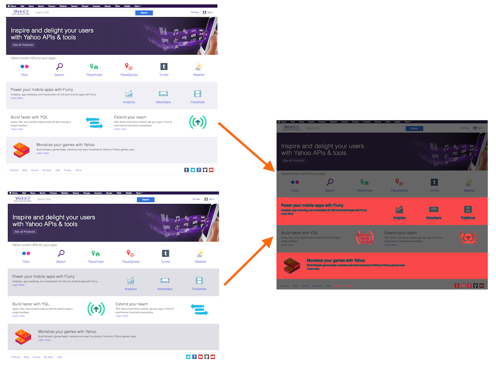

[](https://github.com/kimmobrunfeldt/squint/actions?query=branch%3Amain)

# Squint

> Create visual diffs between two different versions of a web app.

Squint is intended to speed up a manual visual review of a new web app release.
The diffs will likely have false positives due to async loading or animations.
That's ok, the main intention is not to be an automated pass / fail tool.

**Goodies:**

* Puppeteer under the hood
* Smart defaults but highly configurable.

    The goal is to provide most convenience flags via CLI, but allow flexible JS options for advanced tricks.

* Supports connecting to your local Chrome, with its existing logins and sessions. No need to deal with cookies in code.



## Install

`npm i -g squint-cli`

## Usage

*Auto-generated*

```bash
  EXAMPLES

      Compare beta to current production. The whole site is automatically crawled.
      $ squint compare https://example.com https://beta.example.com

      Crawl all paths from beta site and pipe output to a file. The crawler only follows site-internal links.
      $ squint crawl https://beta.example.com > paths.txt

      Get screenshot of a page.
      $ squint screenshot https://beta.example.com

      Get screenshot of a single element in a page.
      $ squint screenshot --selector 'div' https://beta.example.com

      Compare beta to current production, but use an existing file of paths.
      $ squint compare --paths-file paths.txt https://example.com https://beta.example.com

      Compare a single page.
      $ squint compare --single-page https://example.com/about https://beta.example.com/about

      Compare a single element with a selector.
      $ squint compare --selector '#logo' https://example.com https://beta.example.com

      Compare a single element, but use JS to dig an element from the page. (page: Puppeteer.Page) => HTMLElement
      $ squint compare --selector-js '(page) => page.$("#logo")' https://example.com https://beta.example.com

  COMMON OPTIONS

      --help                       Shows this help message
      --include-hash               When enabled, URL hashes are not removed. Default: false
      --trailing-slash-mode        Options: preserve, remove, add. Default: preserve
      --puppeteer-launch-mode      Options: launch, connect. Default: launch
      --puppeteer-launch-options   Puppeteer .launch or .connect options in JS. Default: {"headless":true}
      --js                         Custom JS code that will be run after Puppeteer page.goto has been called.
                                   (page: Puppeteer.Page) => Promise<void>

  COMPARE & SCREENSHOT

      -w --width             Viewport width for Puppeteer. Default: 1280
      -h --height            Viewport height for Puppeteer. Default: 800
      --paths-file           File of URL paths. One path per line.
      --selector             Selector for document.querySelector. The first found element is used.
                             page.waitForSelector is called to ensure the element is visible.
      --selector-js          Selector that uses JS to dig an element. (page: Puppeteer.Page) => HTMLElement
      --screenshot-options   Puppeteer .screenshot options in JS. Overrides other options.

  COMPARE

      --out-dir              Output directory for images. Default: .squint
      --single-page          Disable automatic crawling. Only take a screenshot from single page.
      -o --out-file          Relevant in only in single-page mode. Output file for the diff image.
      --save-all             Saves all diff image files, even if there are zero differences.

  SCREENSHOT

      -o --out-file          Output file for the screenshot

  CRAWL

      --max-depth            Maximum depth of links to follow. Default: Infinity


```

## Tips & tricks

Got a trick? Submit a PR!

### Failing tests with `DEBUG_TESTS=true`

It seems that Puppeteer element screenshot works differently when running with `headless: false`.


### Connect to a Chrome session

*This way you can reuse existing sessions and logins. No need to do difficult setup with cookies.*

1. Close your Chrome process (unless you already have remote debugging enabled).
2. Launch Chrome with a remote debugger enabled

    In macOS: `/Applications/Google\ Chrome.app/Contents/MacOS/Google\ Chrome --remote-debugging-port=9222`

3. `squint screenshot --puppeteer-launch-mode connect --puppeteer-launch-options '{ browserURL: "http://localhost:9222" }' https://example.com`


### Enable very verbose Puppeteer logging

```bash
DEBUG="puppeteer:* squint screenshot https://example.com
```

### Disable headless mode

```bash
squint screenshot --puppeteer-launch-options '{ headless: false }' https://example.com
```

### Interact with page before screenshot

Click "I agree" button to hide ToS popup before taking a screenshot. *Beware of character escaping, it's fragile.*

```bash
squint screenshot https://google.com --puppeteer-launch-options '{ headless: false }' --js 'async (page) => {
  const [button] = await page.$x(`//button[contains(., "I agree")]`);
  await button.click();
}'
```


## Maintenance tasks

### Generating baseline screenshots for tests

*Make sure the images are small because they are stored in git.*

Run `bash tools/populate-test-data.sh` to re-generate PNG images for test cases.
These images are the baseline, and considered to be correct results.

### Making a new release

```
bash release.sh
```